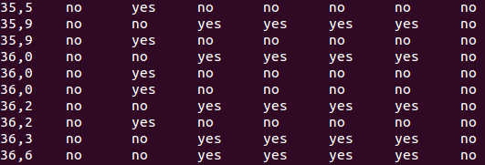
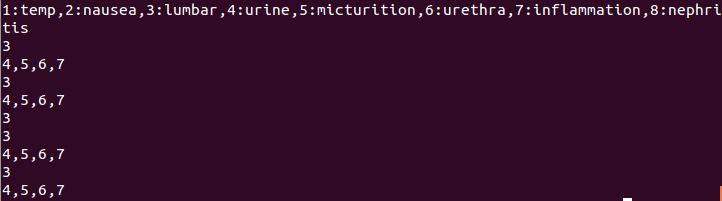
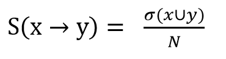
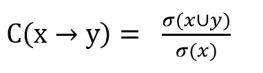
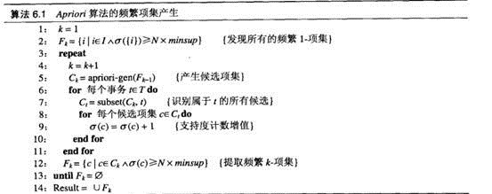
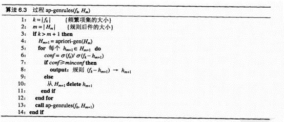
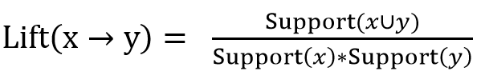
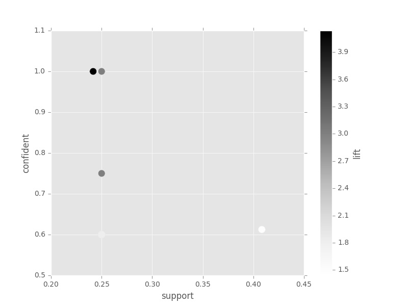

# UCI”急性炎症”数据集关联规则挖掘报告

姓名：李懿

学号：2120151008

## 一、数据预处理&格式转换

预处理部分代码：[preprocess.py](https://github.com/amazingcosmos/DM-course-AssociationRule/blob/master/code/preprocess.py)

原始数据格式如下图所示：



数据由8列特征组成，分别代表体温、恶心、腰疼、连续排尿、排尿疼痛、尿道肿胀、膀胱炎症和肾炎。除了体温为数值属性，其他属性都是二值的标称属性，所以考虑将体温转换为同为标称属性的发烧属性。在实验中选取38摄氏度为基准，低于38度为正常，高于38度为发烧。

对这8个属性标号为1-8，每条记录中只保留数据为“yes”的属性标号，得到处理后的适合关联规则挖掘的数据形式，如下图所示，其中每行代表一条transaction。

```python
疾病代号字典 = {1:'发烧', 2:'恶心', 3:'腰疼', 4:'连续排尿', 5:'排尿疼痛', 6:'尿道肿胀', 7:'膀胱炎症', 8:'肾炎'}
```



## 二、频繁项集挖掘

使用Apriori算法寻找频繁项集。

首先定义支持度S和置信度C的计算公式如下，其中sigma代表计数值，N为transaction总数。





根据先验(apriori)原理：如果一个项集是频繁的，则的所有子集一定是频繁的。若某项集是非频繁的，则其所有的超级也一定是非频繁的。根据给定的置信度0.2，依次找出1-频繁项集、2-频繁项集等等。Apriori算法代码：[apriori.py](https://github.com/amazingcosmos/DM-course-AssociationRule/blob/master/code/apriori.py)中包含数据加载函数load_dataset、生成候选k-频繁项集函数create_c1和create_ck、计算支持度函数calc_surpport、Apriori算法函数apriori等。算法流程图如下：



## 三、导出关联规则，计算支持度和置信度

导出关联规则部分也是使用apriori算法，如果一条规则是低置信度的，则它的子代都是低置信度的。利用这个原则可以进行剪枝，快速生成规则。实现了规则生成算法gen_rules、置信度及支持度计算函数exam_rule等。算法流程图如下：



最终生成规则列表rules，其中每项都是一个字典，包含五项内容。代表一条满足给定置信度0.6的规则及其对应的支持度、置信度、提升度。

| 属性名称 | 类型 | 解释 |
| -------- | ---- | ---- |
| lhs | list | 规则的前件 |
| rhs | list | 规则的后件 |
| support | float | 支持度值 |
| confident | float | 置信度值 |
| lift | float | 提升度值 |

其中提升度lift的计算公式为：



## 四、去除冗余规则

满足置信度和支持度的规则一共有**263**条，但是其中有很多冗余，定义冗余是：如果rule_a的lhs和rhs是包含于rule_b的，而且rule_a的lift小于或者等于rule_b，则称rule_a是rule_b的冗余规则。随后执行对冗余规则的删除操作，生成强规则strong_rules。

[association_rule.py](https://github.com/amazingcosmos/DM-course-AssociationRule/blob/master/code/association_rule.py)实现了调用Apriori算法，生成频繁项集，生成规则并去除冗余规则的操作。执行完成后，还剩余**55**条规则。

## 五、可视化

采用散点图的方式，对去除冗余后的55条规则进行可视化。

[association_rule.py](https://github.com/amazingcosmos/DM-course-AssociationRule/blob/master/code/association_rule.py)调用的pandas库中的预设绘图函数，将规则字典转换为DataFrame数据，然后使用DataFrame.plot.scatter()方法绘制散点图如下所示。图中横坐标为规则的支持度，纵轴为规则的置信度，圆点颜色的深浅代表提升度。其中颜色越深表示提升度越大。



## 六、结果分析

如果选择支持度大于2作为筛选条件，在去除冗余后的规则中，共有**44**条规则属于强规则。

根据疾病代号和对应的中文名称字典进行替换后，规则如下：

| 规则 | 提升度lift | 支持度support | 置信度confident |
| ---- | :--------: | :-----------: | :-------------: |
| 恶心 --> 发烧, 腰疼, 排尿疼痛, 肾炎 | 4.14 | 0.24 | 1.0 |
| 肾炎, 恶心 --> 发烧, 腰疼, 排尿疼痛 | 4.14 | 0.24 | 1.0 |
| 肾炎, 发烧, 排尿疼痛 --> 恶心, 腰疼 | 4.14 | 0.24 | 1.0 |
| 发烧, 腰疼, 排尿疼痛 --> 肾炎, 恶心 | 4.14 | 0.24 | 1.0 |
| 肾炎, 发烧, 腰疼, 排尿疼痛 --> 恶心 | 4.14 | 0.24 | 1.0 |
| 肾炎, 恶心, 腰疼 --> 发烧, 排尿疼痛 | 4.14 | 0.24 | 1.0 |
| 肾炎, 发烧, 恶心 --> 腰疼, 排尿疼痛 | 4.14 | 0.24 | 1.0 |
| 肾炎, 排尿疼痛 --> 发烧, 恶心, 腰疼 | 4.14 | 0.24 | 1.0 |
| 发烧, 恶心, 腰疼 --> 肾炎, 排尿疼痛 | 4.14 | 0.24 | 1.0 |
| 腰疼, 排尿疼痛 --> 肾炎, 发烧, 恶心 | 4.14 | 0.24 | 1.0 |
| 恶心, 腰疼 --> 肾炎, 发烧, 排尿疼痛 | 4.14 | 0.24 | 1.0 |
| 肾炎, 腰疼, 排尿疼痛 --> 发烧, 恶心 | 4.14 | 0.24 | 1.0 |
| 发烧, 排尿疼痛 --> 肾炎, 恶心, 腰疼 | 4.14 | 0.24 | 1.0 |
| 发烧, 恶心 --> 肾炎, 腰疼, 排尿疼痛 | 4.14 | 0.24 | 1.0 |
| 肾炎, 尿道肿胀 --> 发烧, 腰疼, 连续排尿 | 3.0 | 0.25 | 1.0 |
| 发烧, 尿道肿胀 --> 肾炎, 腰疼, 连续排尿 | 3.0 | 0.25 | 1.0 |
| 腰疼, 连续排尿 --> 肾炎, 发烧, 尿道肿胀 | 3.0 | 0.25 | 0.75 |
| 腰疼, 尿道肿胀 --> 肾炎, 发烧, 连续排尿 | 3.0 | 0.25 | 1.0 |
| 发烧, 连续排尿 --> 肾炎, 腰疼, 尿道肿胀 | 3.0 | 0.25 | 0.75 |
| 肾炎, 连续排尿 --> 发烧, 腰疼, 尿道肿胀 | 3.0 | 0.25 | 0.75 |
| 肾炎, 发烧, 连续排尿 --> 腰疼, 尿道肿胀 | 3.0 | 0.25 | 0.75 |
| 发烧, 腰疼, 连续排尿 --> 肾炎, 尿道肿胀 | 3.0 | 0.25 | 0.75 |
| 发烧, 腰疼, 尿道肿胀 --> 肾炎, 连续排尿 | 3.0 | 0.25 | 1.0 |
| 肾炎, 发烧, 尿道肿胀 --> 腰疼, 连续排尿 | 3.0 | 0.25 | 1.0 |
| 肾炎, 腰疼, 连续排尿 --> 发烧, 尿道肿胀 | 3.0 | 0.25 | 0.75 |
| 肾炎, 腰疼, 尿道肿胀 --> 发烧, 连续排尿 | 3.0 | 0.25 | 1.0 |
| 尿道肿胀, 膀胱炎症 --> 连续排尿, 排尿疼痛 | 2.45 | 0.24 | 1.0 |
| 恶心, 腰疼, 排尿疼痛 --> 肾炎, 发烧 | 2.4 | 0.24 | 1.0 |
| 肾炎, 恶心, 排尿疼痛 --> 发烧, 腰疼 | 2.4 | 0.24 | 1.0 |
| 发烧, 恶心, 排尿疼痛 --> 肾炎, 腰疼 | 2.4 | 0.24 | 1.0 |
| 恶心, 排尿疼痛 --> 肾炎, 发烧, 腰疼 | 2.4 | 0.24 | 1.0 |
| 发烧, 恶心, 腰疼, 排尿疼痛 --> 肾炎 | 2.4 | 0.24 | 1.0 |
| 肾炎, 发烧 --> 腰疼, 连续排尿, 尿道肿胀 | 2.4 | 0.25 | 0.6 |
| 腰疼, 连续排尿, 尿道肿胀 --> 肾炎, 发烧 | 2.4 | 0.25 | 1.0 |
| 肾炎, 连续排尿, 尿道肿胀 --> 发烧, 腰疼 | 2.4 | 0.25 | 1.0 |
| 肾炎 --> 发烧, 腰疼, 连续排尿, 尿道肿胀 | 2.4 | 0.25 | 0.6 |
| 发烧, 腰疼 --> 肾炎, 连续排尿, 尿道肿胀 | 2.4 | 0.25 | 0.6 |
| 肾炎, 腰疼 --> 发烧, 连续排尿, 尿道肿胀 | 2.4 | 0.25 | 0.6 |
| 发烧, 连续排尿, 尿道肿胀 --> 肾炎, 腰疼 | 2.4 | 0.25 | 1.0 |
| 发烧, 腰疼, 连续排尿, 尿道肿胀 --> 肾炎 | 2.4 | 0.25 | 1.0 |
| 连续排尿, 尿道肿胀, 膀胱炎症 --> 排尿疼痛 | 2.03 | 0.24 | 1.0 |
| 肾炎, 发烧, 恶心, 腰疼 --> 排尿疼痛 | 2.03 | 0.24 | 1.0 |
| 连续排尿, 排尿疼痛, 尿道肿胀 --> 膀胱炎症 | 2.03 | 0.24 | 1.0 |
| 排尿疼痛, 尿道肿胀 --> 连续排尿, 膀胱炎症 | 2.03 | 0.24 | 1.0 |

可以看到，当提升度相同时，有很多规则仍然是重复的，表示几个病症同时发生的概率很大。对这种情况做去重之后，得到以下几个互相之间强相关的疾病。

| 并发症 | 提升度lift | 支持度support | 置信度confident |
| ------ | :--------: | :-----------: | :-------------: |
| 肾炎, 发烧, 恶心, 腰疼, 排尿疼痛 | 4.14 | 0.24 | 1.0 |
| 肾炎, 发烧, 腰疼, 连续排尿, 尿道肿胀 | 3.0 | 0.25 | 1.0 |
| 连续排尿, 排尿疼痛, 尿道肿胀, 膀胱炎症 | 2.45 | 0.24 | 1.0 |


## 参考资料

1. http://www.cnblogs.com/dolphin0520/archive/2012/10/29/2733356.html
2. http://www.jb51.net/article/57209.htm
3. http://www.cnblogs.com/Dzhouqi/p/3464995.html
4. http://blog.csdn.net/gjwang1983/article/details/45015203
5. http://www.cnblogs.com/lzllovesyl/p/5434401.html
